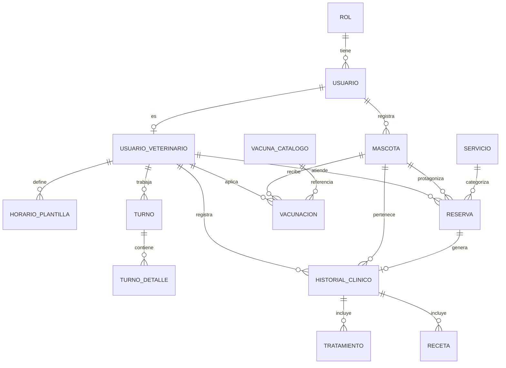

# 🐾 PetVission

> Plataforma web integral para gestión de clínicas veterinarias.  
> Proyecto Integrador — Java Generation Fullstack Developer Bootcamp

---

## 📦 Repositorios del proyecto

| Repo | Descripción | Link |
|---|---|---|
| `petvission-frontend` | Interfaz web — React 18, Vite, React Router, pnpm | [→ Ver repo](https://github.com/DiegoPenaG/petvission-front) |
| `petvission-backend` | API REST — Java 21, Spring Boot, PostgreSQL | [→ Ver repo](https://github.com/DiegoPenaG/Proyecto-Integrador-Pet-vission-BackEnd) |

---

## 👥 Equipo — Escuadrón Alpha Mango

| Nombre | Rol Scrum | Rol Técnico | GitHub |
|---|---|---|---|
| Sabrina Jeria | Product Owner + Scrum Master | Gestión y coordinación | [@sabrinaceciliajeria-cmyk](https://github.com/sabrinaceciliajeria-cmyk) |
| Diego Peña | Dev Team | Tech Lead | [@DiegoPenaG](https://github.com/DiegoPenaG) |
| Arantxa Fischer | Dev Team | Frontend Developer | [@a-scarfisch](https://github.com/a-scarfisch) |
| Cristian Díaz | Dev Team | Backend Developer | [@Cristian-DH](https://github.com/Cristian-DH) |
| Cristopher Contreras | Dev Team | Backend Developer | [@cristophercontrerasinformatica-dev](https://github.com/cristophercontrerasinformatica-dev) |
| Natalia Medel | Dev Team | Backend Developer | [@NataliaMedelM](https://github.com/NataliaMedelM) |
| Manuel Labrador | QA | Quality Assurance | [@MannuDLab](https://github.com/MannuDLab) |

---

## 🛠️ Stack tecnológico

| Capa | Tecnología | Versión |
|---|---|---|
| Frontend | React | 18 |
| Frontend | Vite | Última estable |
| Frontend | React Router | Última estable |
| Frontend | pnpm | >= 9 |
| Backend | Java | 21 LTS |
| Backend | Spring Boot | Última estable |
| Backend | Spring Security + JWT | Incluida |
| Base de datos | PostgreSQL (NeonDB) | 17 |
| Deploy Frontend | Vercel | — |
| Deploy Backend | Render (Docker) | — |
| Pagos | MercadoPago | sandbox |
| Diseño | Figma | — |
| Gestión | Trello | — |
| Control de versiones | Git + GitHub | — |

---

## 🚀 Deploy

| Servicio | Plataforma | URL |
|---|---|---|
| Frontend | Vercel | [petvission-front.vercel.app](https://petvission-front.vercel.app) |
| Backend API | Render | [proyecto-integrador-pet-vission-backend.onrender.com](https://proyecto-integrador-pet-vission-backend.onrender.com) |

---

## 📋 Sprints

| Sprint | Período | Objetivo |
|---|---|---|
| Sprint 1 | Sem 8–9 | Planificación, estructura base, diseño, landing page |
| Sprint 2 | Sem 10–11 | Auth, mascotas, reservas — backend + frontend conectado |
| Sprint 3 | Sem 12–13 | Historial clínico, turnos, vacunación, panel admin |
| Sprint 4 | Sem 14 | Testing, documentación, deploy y cierre |

---

## 👤 Roles del sistema

| Rol | Acceso |
|---|---|
| **Cliente** | Dashboard, mis mascotas, mis reservas, agendamiento de citas |
| **Veterinario** | Dashboard, agenda/citas, horarios, mis pacientes, historial clínico |
| **Administrador** | Panel completo: usuarios, veterinarios, mascotas, citas y horarios |

---

## 🗃️ Modelo de base de datos

