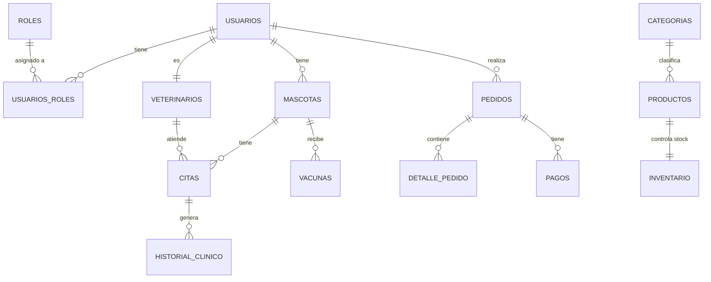

# 🐾 VetVission

> Plataforma web integral para gestión de clínicas veterinarias con e-commerce incorporado.  
> Proyecto Integrador — Java Generation Fullstack Developer Bootcamp

---

## 📦 Repositorios del proyecto

| Repo | Descripción | Link |
|---|---|---|
| `vetvission-frontend` | Interfaz web — HTML, CSS, Bootstrap, JS | [→ Ver repo](https://github.com/DiegoPenaG/Proyecto-Integrador-Vet-vission-FrontEnd) |
| `vetvission-backend` | API REST — Java, Spring Boot, PostgreSQL | [→ Ver repo](https://github.com/DiegoPenaG/Proyecto-Integrador-Vet-vission-BackEnd) |

---

## 👥 Equipo — Escuadrón Alpha Mango

| Nombre | Rol Scrum | Rol Técnico |
|---|---|---|
| Sabrina Jeria | Product Owner + Scrum Master | Gestión y coordinación |
| Diego Peña | Dev Team | Tech Lead |
| Arantxa Fischer | Dev Team | Frontend Developer |
| Cristian Díaz | Dev Team | Backend Developer |
| Cristopher Contreras | Dev Team | Backend Developer |
| Natalia Medel | Dev Team | Frontend / DB Support |
| Manuel Labrador | QA | Quality Assurance |

---

## 🛠️ Stack tecnológico

| Capa | Tecnología |
|---|---|
| Frontend | HTML5, CSS3, Bootstrap 5, JavaScript |
| Backend | Java 17, Spring Boot, Spring Security |
| Base de datos | PostgreSQL (NeonDB) |
| Autenticación | JWT |
| Pagos | MercadoPago (sandbox) |
| Diseño | Figma |
| Gestión | Trello |
| Control de versiones | Git + GitHub |

---

## 📋 Sprints

| Sprint | Período | Objetivo |
|---|---|---|
| Sprint 1 | Sem 8–9 | Planificación, estructura base, diseño, landing page |
| Sprint 2 | Sem 10–11 | Auth, mascotas, citas — backend + frontend conectado |
| Sprint 3 | Sem 12–13 | E-commerce, pagos, dashboard |
| Sprint 4 | Sem 14 | Testing, documentación, deploy y cierre |

---

## 🗃️ Modelo de base de datos

> Diagrama completo disponible en `vetvission-backend/docs/schema.sql`

---

## 🔗 Recursos del proyecto

- 📋 [Trello Sprint 1](#)
- 🎨 [Figma Diseño](#)
- 📄 [Informe del proyecto](#)
